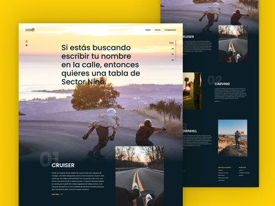

# Sector 9 Landing
Este proyecto pertenece a [Leonidas Esteban](https://leonidasesteban.com) y su equipo de diseño. Sector es una marca reconocida de longboards y este es el rediseño de su marca. Codificado y desarrollado por Fernando Ortiz. Este trabajo tiene como, principal objetivo, mejorar habilidades, y seguir aprendiendo sobre layout con CSS. Además tiene una pequeña funcionalidad con Javascript.

# Agradecimientos
Gracias a Leonidas por crear /proyectos, una plataforma para seguir aprendiendo y practicando con proyectos que se asemejan a la vida real.

# Miralo en linea
Puedes ver el proyecto terminado y en linea [aquí]()

